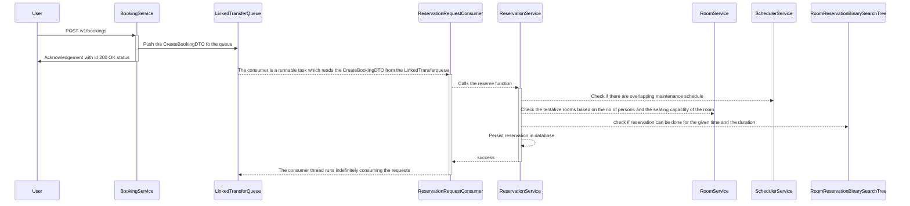
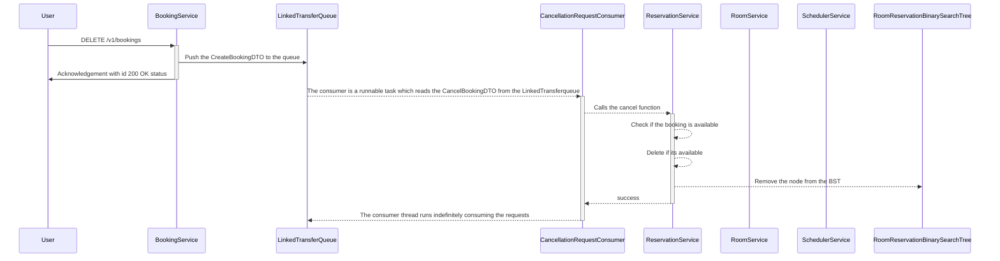
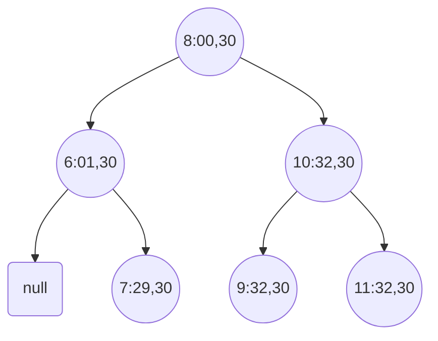

# Conference room reservation service

http://localhost:8080/swagger-ui/index.html#/room-controller/getRooms

### Table of Contents
- [Introduction](#introduction)
- [Prerequisites](#prerequisites)
- [Technical Specifications](#technical-specifications)
- [Local Run](#local-run)
- [Testing h2](#testing-h2)
- [Mind map](#mind-map)
- [Sequence Diagram](#sequence-diagram)
  - [Reserve a Room](#reserve-a-room)
  - [Delete a booking](#delete-a-booking)
- [Binary Search Tree Implementation](#binary-search-tree-implementation)
- [Project Details](#project-details)
- [API Documentation](#api-documentation)
- [Future enhancements](#future-enhancements)

## Introduction

 - Application to reserve room based on the availability

## Prerequisites
 - Docker installed
 - git to pull the code

## Technical Specifications
 - Springboot framework version 3.2.0
 - Java 17
 - Redis for caching
 - H2 for database
 - Docker for containerization
 - Spring scheduler for scheduling daily operations

## Local Run

 - Checkout the code from github master branch
 - Run docker compose up --build 
 - Run docker compose down to down the application

## Testing h2
 - http://localhost:8080/h2-console/login.do
 - JDBC url: jdbc:h2:mem:rooms
 - Username: sa
 - Password: password

## Mind map

## Sequence Diagram
## Reserve a Room

## Delete a booking

## Binary Search Tree Implementation

The node in the BST are created in the order of requests.
Each node is composed of the data structure
{ 
 element:LocalTime,
 duration:long
}
Each node can have a left and a right node.
Below shown a BST with nodes elements and their child nodes

Inorder traversal of the BST gives :
[(6:01,30),(7:29,30),(8:00,30),(9:32,30),(10:32,30),(11:32,30)]

## Project Details
 - The reservation uses Binary Search tree to book the room.
 - The room details and the maintenance schedule is saved in the database using migration scripts
 - On system startup, the maintenance booking is reserved in the reservation system.
   - The BST tree is created from the reservation bookings.
   - The tasks ReservationRequestConsumer and CancellationRequestConsumer tasks are started which runs indefinitely.
 - The scheduler runs every midnight to clear the caches and to create the maintenance schedule for the rooms.
 - On the create booking API call, the user request is pushed to the LinkedTransferQueue
   - The ReservationRequestConsumer reads the request from the LinkedTransferQueue and calls the ReservationService.
   - The ReservationService will reserve the room based on the rules:
     - Should not be within the maintenance schedule
     - Should not overlap any existing bookings
     - The reservation is created in the database and the BST cache
 - On the delete reservation call,the user request is pushed to the LinkedTransferQueue
   - The CancellationRequestConsumer listens the request and calls the ReservationService for room cancellation.
   - The ReservationService will check the booking and if it exists it will delete from both the DB and the cache.
   - 
 
## API Documentation
API documentation can be found by navigating to http://localhost:8080/swagger-ui/index.html#/

## Future enhancements
 - Integrating a user service and spring security to implement the RBAC of the APIs.
 - Cache clear for the different caches in the application
 - Few extra validation in the APIs
 - The failure requests could be logged to the database. It increases the scope of the problem in question.
 - CICD pipeline and deploying to server.

