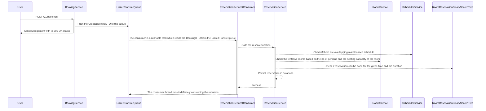

# Conference room reservation service

http://localhost:8080/swagger-ui/index.html#/room-controller/getRooms

### Table of Contents
- [Introduction](#introduction)
- [Prerequisites](#prerequisites)
- [Technical Specifications](#technical-specifications)
- [Local Run](#local-run)
- [Testing h2](#testing-h2)
- [Mind map](#mind-map)
- [Sequence Diagram](#sequence-diagram)

## Introduction

 - Application to reserve room based on the availability

## Prerequisites
 - Docker installed
 - git to pull the code

## Technical Specifications
 - Springboot framework version 3.2.0
 - Java 17
 - Redis for caching
 - H2 for database
 - Docker for containerization
 - Spring scheduler for scheduling daily operations

## Local Run

 - Checkout the code from github master branch
 - Run docker compose up --build 
 - Run docker compose down to down the application

## Testing h2
 - http://localhost:8080/h2-console/login.do
 - Username: sa
 - Password: password

## Mind map

## Sequence Diagram

